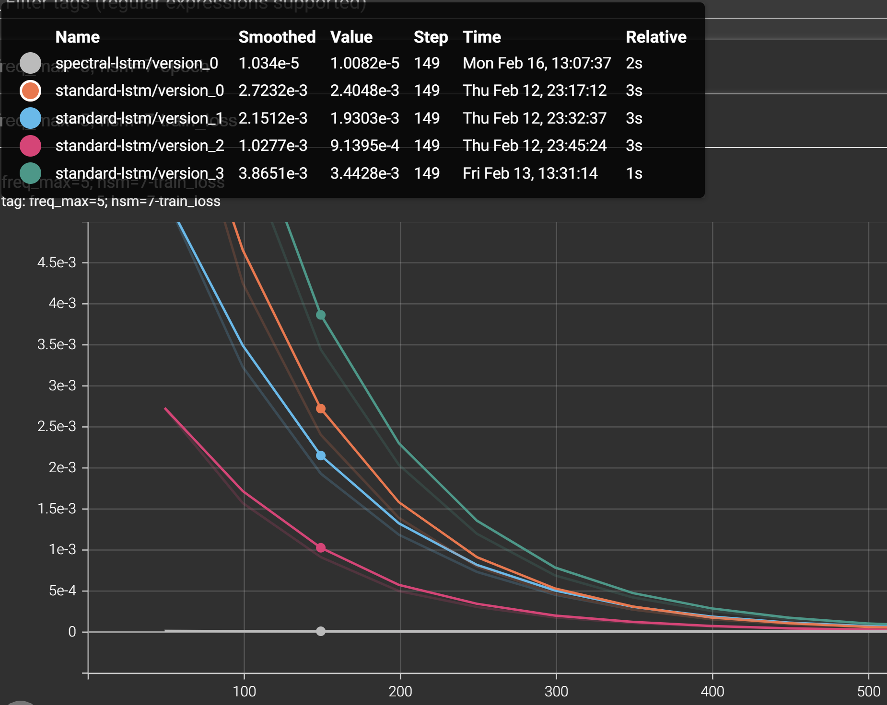
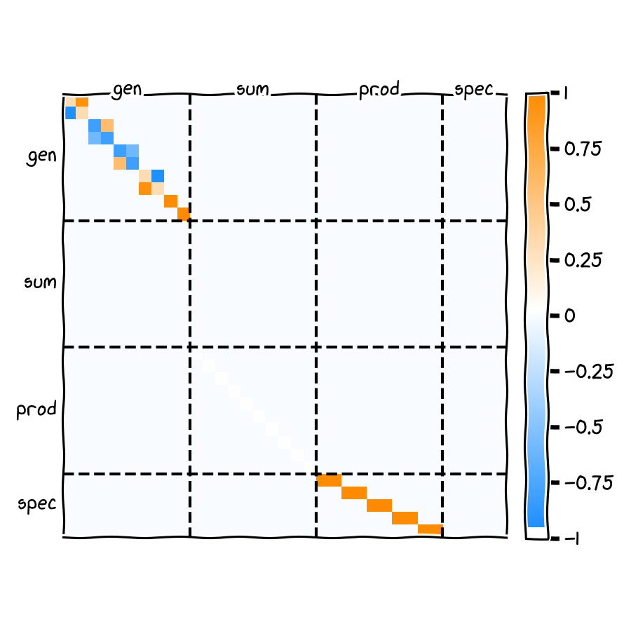

# wavebase

Wavebase constructs an explicitly parameterized LSTM whose recurrent
dynamics implement the discrete Fourier transform (DFT) and compute the
windowed power spectrum of a one-dimensional signal.

The repository studies the behavior of this structured solution under
gradient descent. Starting from a provably correct spectral
construction, we train the network and observe whether optimization
preserves the algorithmic structure, deforms it continuously, or
replaces it with an alternative representation.

Originally presented as a research poster at Google (Chelsea), February
2018.

Note: This repository is a research artifact and is not intended as a
practical replacement for FFT libraries.

## Target computation

For each window $x_{j:j+T-1}$ of length $T$, the model computes
$$
P_j[k] = | \sum_{t=0}^{T-1} x_{j+t} \, e^{-2 \pi i k t/T} |^2, k = 0, …, T-1.
$$

The sequence ${P_j[k]}$ forms a spectrogram over non-overlapping windows.

The construction realizes this computation through real-valued recurrent
oscillator dynamics rather than an explicit FFT.

## Exact construction

The LSTM hidden state is partitioned into structured blocks:

-   `gen` — block-diagonal planar rotations generating Fourier basis
    vectors
-   `sum` — windowed accumulation of Fourier coefficients
-   `prod` — elementwise squaring of real and imaginary components
-   `spec` — linear aggregation into $|z_k|^2$

Hidden size must be a multiple of 7 due to block partitioning (gen, sum,
prod, spec and supporting indices).

Exact construction

The LSTM hidden state is partitioned into structured blocks:

-   gen — block-diagonal planar rotations generating Fourier basis
    vectors
-   sum — windowed accumulation of Fourier coefficients
-   prod — elementwise squaring of real and imaginary components
-   spec — linear aggregation into $|z_k|^2$

The recurrent weight matrix contains explicit rotation subblocks with
period T, enforcing oscillator dynamics that correspond to complex
exponentials under the identification $\mathbb{C} \cong \mathbb{R}^2$.

The exact parameterization is defined in [test/test_specifications.py](test/test_specifications.py).
Hidden size must be a multiple of 7 due to block partitioning.



## Structured recurrent matrix



Figure 1. Recurrent cell weight matrix at initialization
(weight_hh_cell). Block-diagonal regions implement discrete oscillators;
lower blocks implement accumulation and spectral pooling.

This matrix serves as a reference algorithmic configuration. Training
experiments track deviation from this structure.

Optimization experiments

The primary experiment is implemented in:
```
scripts/benchmark.py
```
We compare:

1.  Exact spectral initialization
2.  The same model trained with gradient descent
3.  Randomly initialized LSTM baselines

on synthetic sinusoidal signals.

Learning curves measure convergence and structural drift, allowing
inspection of how gradient descent interacts with a known correct
recurrent algorithm.

## Implementation details

-   Input size must be 1 (scalar time series).
-   Hidden size must be divisible by 7.
-   The input gate activation is modified to tanh to permit signed
    gating required by the construction.
-   Hidden indices are exposed as gen_, sum_, prod_, and spec_.

## Installation and quick start

Install dependencies (this project uses PyTorch; see `requirements.txt`):

```bash
pip install -r requirements.txt
```

Run the unit tests for data generation:

```bash
pytest test/test_data_generator.py -q
```

Run the benchmark experiment:

```bash
python scripts/benchmark.py
```

## What this is not

This repository is not intended as a practical alternative to FFT
implementations. It does not claim improved computational complexity,
efficiency, or performance over classical spectral algorithms. The
purpose of this work is to provide a controlled setting in which a
gated recurrent network is initialized at an exact algorithmic solution,
enabling empirical study of optimization dynamics and representational
stability.
